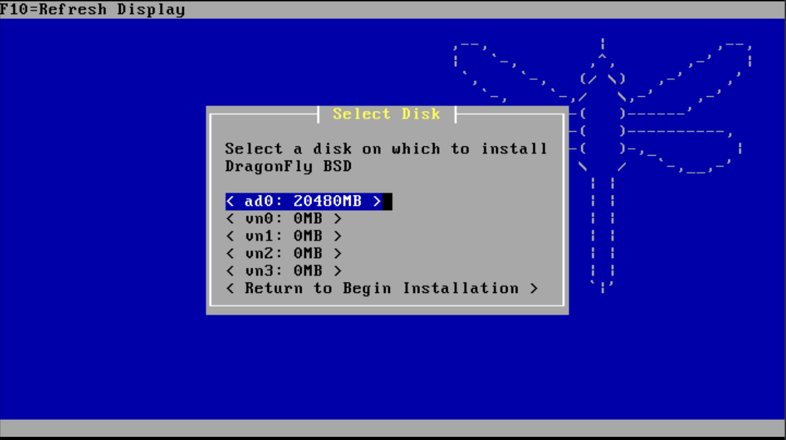

# راه‌اندازی و استقرار NetBSD بر بستر QEMU/KVM

سیستم‌عامل NetBSD به پرتابل بودن (Portability)، طراحی ماژولار و کدهای به شدت تمیز شهرت دارد؛ شعار معروف *"Of course it runs NetBSD"* گواه اجرای آن روی ده‌ها معماری سخت‌افزاری مختلف است. اما در محیط‌های زیرساخت و مجازی‌سازی مدرن لینوکس (بر پایه KVM)، اجرای بهینه و با راندمان بالای NetBSD نیازمند پیکربندی درست شتاب‌دهنده سخت‌افزاری، درایورهای پرسرعت Paravirtualization (مجموعه VirtIO) و مدیریت صحیح کنسول سریال یا گرافیکی است.

در این مستند فنی، مراحل راه‌اندازی NetBSD 10.x روی QEMU/KVM را از ایجاد دیسک و تعریف سوییچ‌های عملکردی تا مراحل نصب و تنظیمات پایه بررسی می‌کنیم.



> ### ۱. آماده‌سازی ایمیج دیسک با فرمت qcow2

برای کارایی بهتر در لایه استوریج و بهره‌گیری از قابلیت Thin Provisioning، یک دیسک با فرمت `qcow2` می‌سازیم:

```bash
qemu-img create -f qcow2 netbsd.qcow2 20G
```

<br>

> ### ۲. اجرای ماشین مجازی با سوییچ‌های بهینه‌سازی (KVM + VirtIO)

برای اینکه بیشترین بازدهی I/O و CPU حاصل شود، از درایورهای پاراویرچوال `virtio-net` و `virtio-blk` استفاده می‌کنیم که در کرنل‌های مدرن NetBSD به صورت Native پشتیبانی می‌شوند:

```bash
qemu-system-x86_64 \
    -enable-kvm \
    -m 2048 \
    -smp 2 \
    -cpu host \
    -drive file=netbsd.qcow2,if=virtio,format=qcow2,cache=none \
    -cdrom NetBSD-10.0-amd64.iso \
    -boot d \
    -netdev user,id=net0,hostfwd=tcp::2222-:22 \
    -device virtio-net-pci,netdev=net0 \
    -display default
```

**نکات مهم معماری در این فرمان:**
* **`-cpu host` و `-enable-kvm`:** دسترسی مستقیم به Instruction Setهای پردازنده فیزیکی بدون لایه شبیه‌سازی نرم‌افزاری.
* **`if=virtio` و `virtio-net-pci`:** حذف سربار درایورهای شبیه‌سازی‌شده IDE یا e1000 و ارتباط با باس پرسرعت VirtIO.
* **`hostfwd=tcp::2222-:22`:** مپ کردن پورت SSH ماشین مهمان به پورت ۲۲۲۲ هاست جهت دسترسی ریموت بدون نیاز به بریج شبکه.

<br>

> ### ۳. مراحل نصب از طریق نصاب sysinst

پس از بوت شدن ایمیج، وارد محیط کاربری مبتنی بر کاراکتر (Curses-based) نصاب بومی نت‌بی‌اس یعنی `sysinst` می‌شوید:

1. زبان را روی `a: Installation in English` انتخاب کنید.
2. گزینه `a: Install NetBSD to hard disk` را انتخاب نمایید.
3. درایور دیسک شناسایی‌شده را تایید کنید (به عنوان مثال `ld0` که دیسک VirtIO است).
4. نوع پارتیشن‌بندی دیسک را بر اساس نیاز انتخاب کنید (برای ماشین‌های استاندارد BIOS/MBR گزینه `MBR partitions` یا برای سیستم‌های مبتنی بر UEFI گزینه `GPT`).
5. فایل‌سیستم را روی FFSv2 با پشتیبانی لاگینگ (`WAPBL`) قرار دهید تا در قطعی‌های ناگهانی برق نیازی به اسکن کامل دیسک نباشد.
6. مجموعه بسته‌های پیش‌فرض (`Full installation`) را انتخاب کرده و اجازه دهید استخراج بسته‌ها از روی مدیا انجام گیرد.

<br>

> ### ۴. تنظیمات پس از نصب و آماده‌سازی SSH

پیش از ریبوت، چند گام اساسی در منوی پیکربندی نهایی نصاب پیشنهاد می‌شود:

* **تنظیم گذرواژه ریشه (root password):** یک پسورد امن برای کاربر root تعیین کنید.
* **ایجاد کاربر عملیاتی:** ساخت یک کاربر معمولی و عضویت آن در گروه `wheel` برای انجام امور مدیریتی.
* **فعال‌سازی سرویس sshd:** در صورتی که در مرحله نصب فعال نشد، پس از اولین بوت در `/etc/rc.conf` خط زیر را اضافه کنید:

```sh
sshd=YES
```

همچنین کارت شبکه به عنوان `vioif0` شناخته می‌شود. برای دریافت خودکار IP از سرویس DHCP در `/etc/rc.conf` مقدار زیر را اعمال نمایید:

```sh
ifconfig_vioif0="dhcp"
```

<br>

> ### ۵. بوت نهایی بدون مدیای نصب

پس از اتمام مراحل، ماشین را خاموش کرده و برای بوت‌های دائمی، مدیا را جدا کرده و سیستم را بالا بیاورید:

```bash
qemu-system-x86_64 \
    -enable-kvm \
    -m 2048 \
    -smp 2 \
    -cpu host \
    -drive file=netbsd.qcow2,if=virtio,format=qcow2,cache=none \
    -netdev user,id=net0,hostfwd=tcp::2222-:22 \
    -device virtio-net-pci,netdev=net0 \
    -nographic
```

> **نکته برای محیط‌های هدلس سروری:** با قرار دادن پرچم `-nographic` و هدایت کنسول NetBSD به `com0` در فایل `/boot.cfg`، می‌توانید مستقیماً ترمینال NetBSD را درون TTY شل لینوکسی خود بدون نیاز به پنجره گرافیکی در اختیار داشته باشید.